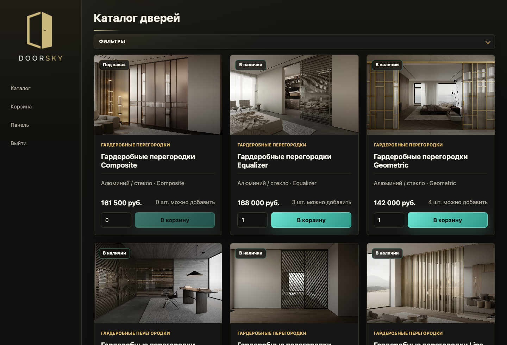
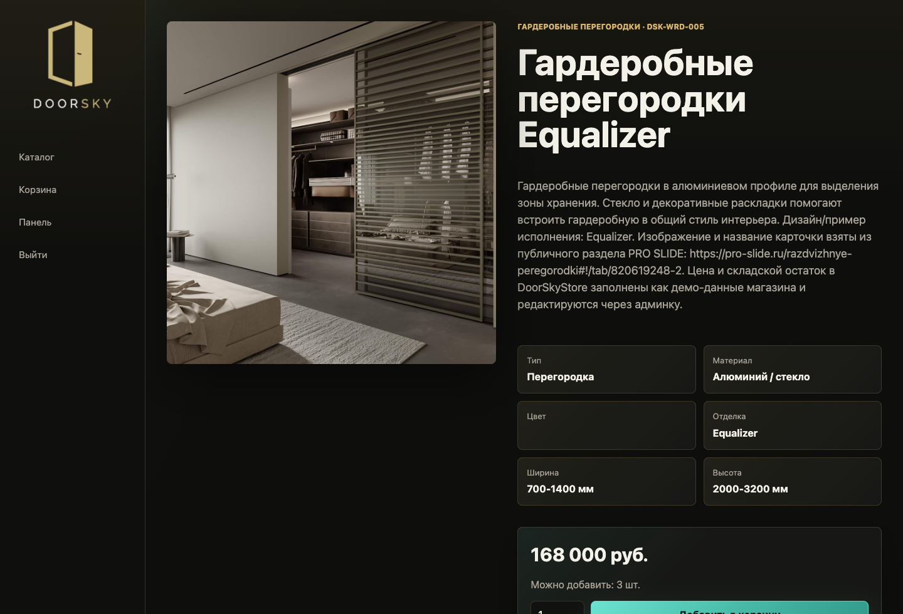
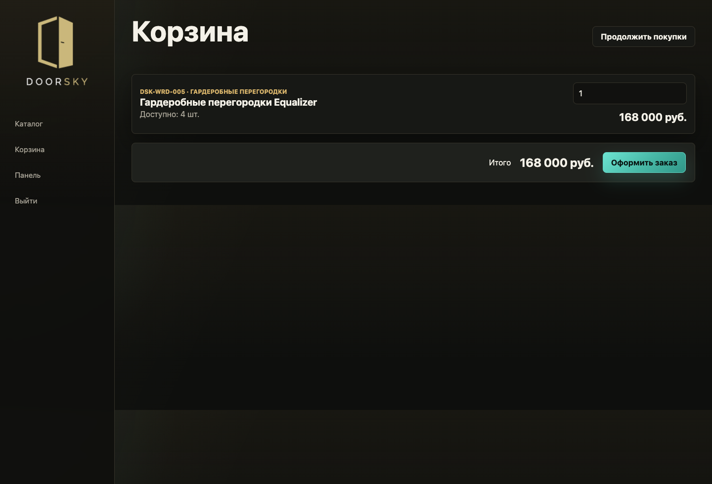
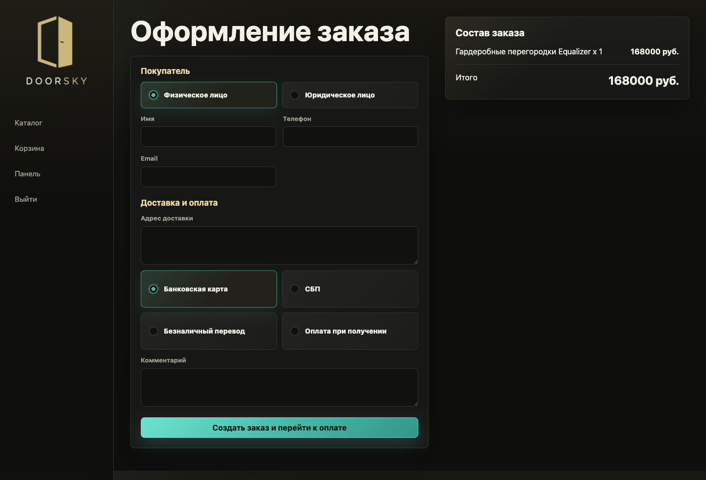
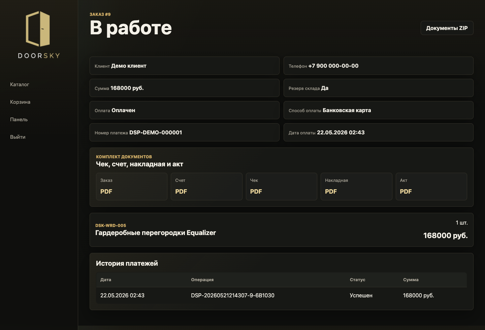
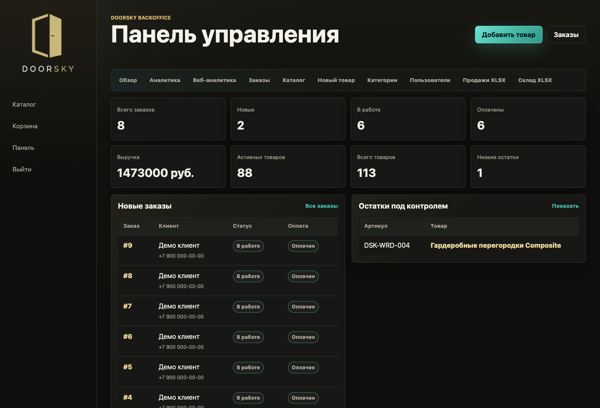
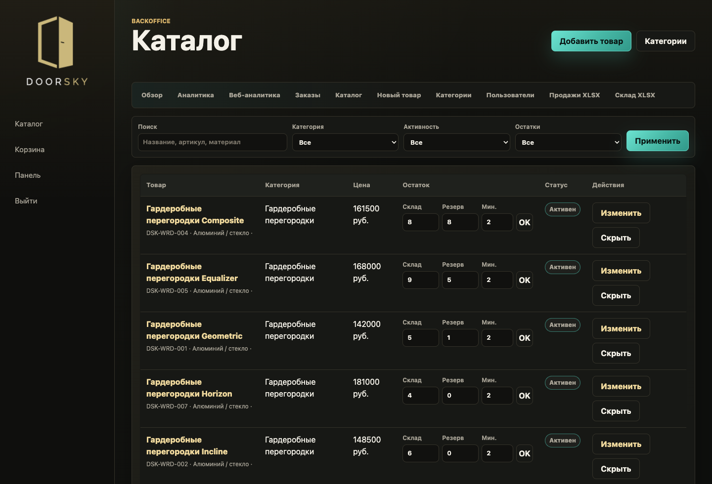
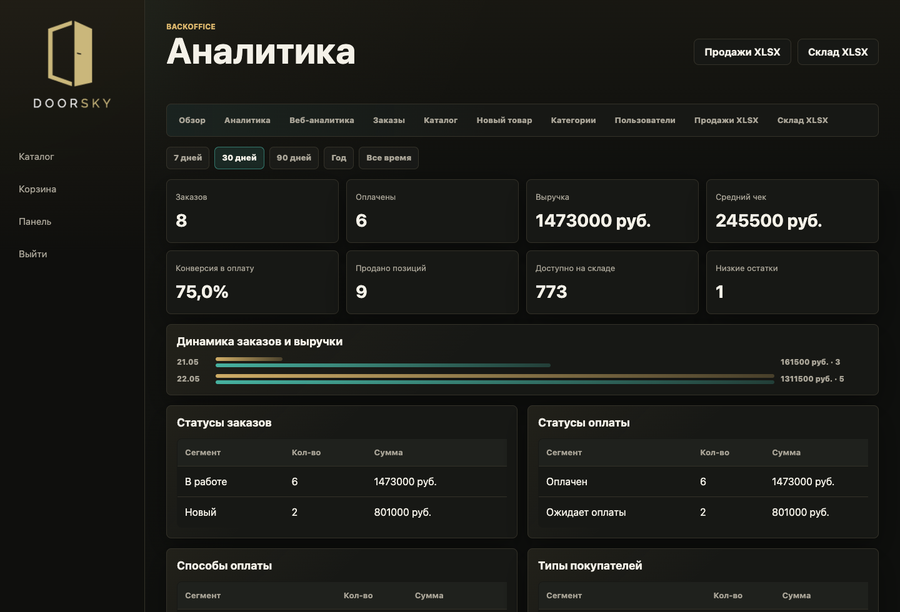
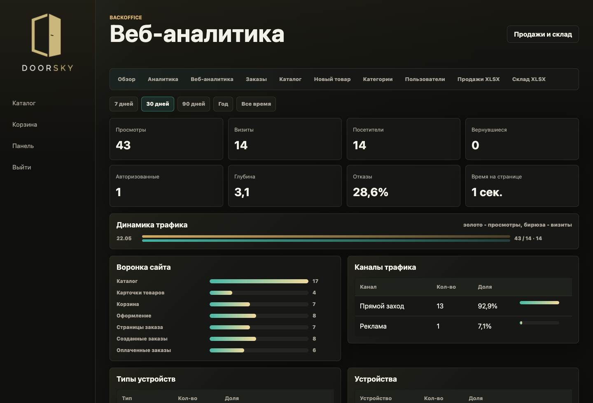

# DoorSkyStore

Полноценная информационная система интернет-магазина дверей DoorSky: публичный каталог, корзина, оформление заказа, складской учет, платежный симулятор, документы, отчеты, веб-аналитика и кастомная админ-панель.

Production: https://doorsky.site

## Скриншоты интерфейса

| Каталог | Карточка товара |
| --- | --- |
|  |  |

| Корзина | Оформление заказа |
| --- | --- |
|  |  |

| Документы заказа | Панель управления |
| --- | --- |
|  |  |

| Каталог в backoffice | Бизнес-аналитика |
| --- | --- |
|  |  |

| Веб-аналитика |
| --- |
|  |

## Статус

- Production-домен подключен к серверу через Caddy и HTTPS.
- Приложение развернуто Docker Compose стеком Django + PostgreSQL.
- Сервер подключен к GitHub через read-only deploy key.
- Основной deployment script: `/srv/doorsky/deploy.sh`.
- В репозитории нет production-секретов, `.env`, SQLite-базы и пользовательских media/staticfiles.

## Стек

| Слой | Технологии |
| --- | --- |
| Backend | Python, Django, Django REST Framework |
| Database | PostgreSQL в production, SQLite для локальной быстрой разработки |
| Frontend | HTML, CSS, JavaScript, React Islands без SPA-переписывания всего сайта |
| Assets | Vite, статический production bundle в `static/react/` |
| Runtime | Docker, Docker Compose, Gunicorn |
| Reverse proxy | Caddy с автоматическим SSL |
| Email | Django email backend, SMTP через env-переменные |
| Documents | PDF-документы через серверную генерацию |
| Reports | XLSX-выгрузки и управленческие отчеты |
| SEO | `sitemap.xml`, `robots.txt`, человеко-понятные URL |

## Что реализовано

### Публичный магазин

- Каталог дверей с категориями, ценами, характеристиками, фотографиями и остатками.
- Данные каталога наполнены на основе публичной структуры и визуалов PRO SLIDE.
- AJAX-фильтры по поиску, категории, типу открывания, материалу, цвету, цене и наличию.
- Бескнопочная дозагрузка каталога через `IntersectionObserver`.
- Lazy loading изображений, плавный fade-in и skeleton-состояния.
- Карточки товаров выровнены по цене, описанию и зоне добавления в корзину.
- Детальная страница товара с характеристиками и покупкой.
- Корзина с AJAX-обновлением количества.
- Оформление заказа для физического и юридического лица.
- Разные способы оплаты: банковская карта, СБП, безналичный перевод, оплата при получении.
- Регистрация и вход обычных покупателей.
- Личный кабинет покупателя с историей заказов.
- Профиль покупателя с сохранением контактных данных и реквизитов.
- Адресная книга доставки и автоподстановка данных в checkout.
- Подтверждение email 6-значным кодом, отправляемым на почту.

### Склад и бизнес-логика

- Контроль доступного количества в каталоге, карточке товара, корзине и checkout.
- Нельзя добавить или выставить в корзине больше доступного остатка.
- Резервирование склада при создании заказа.
- Списание склада при подтверждении заказа.
- Снятие резерва при отмене.
- Журнал движений склада: резерв, снятие резерва, продажа, корректировка.
- Минимальные остатки и признаки необходимости пополнения.
- Серверная проверка остатка защищает от обхода frontend-ограничений.

### Заказы и оплата

- Создание заказа из корзины.
- Публичная страница заказа по `public_key`.
- Имитация проведения платежа.
- Статусы оплаты: ожидание, обработка, оплачено, ошибка, возврат.
- История платежных транзакций.
- Оплаченный заказ переводится в работу.
- Для оплаты при получении заказ создается без перехода в платежный симулятор.

### Документы

Для заказа генерируются PDF-документы:

- заказ;
- счет;
- чек;
- накладная;
- акт.

Документы доступны:

- для клиента на публичной странице заказа;
- для менеджера в панели `/office/`;
- по одному PDF;
- ZIP-пакетом.

PDF открывается в браузерной модалке без скачивания по умолчанию. Скачивание доступно отдельным действием.

### Кастомная админка

Кастомная панель управления: `/office/`.

Стандартный `/admin/` редиректит в кастомную панель.

В панели есть:

- дашборд;
- заказы;
- карточка заказа;
- симуляция успешной/ошибочной оплаты;
- подтверждение и отмена заказа;
- каталог;
- создание и редактирование товаров;
- категории;
- складские остатки;
- корректировка количества и резерва;
- пользователи;
- группы;
- выдача ролей и точечных прав;
- бизнес-аналитика;
- веб-аналитика.

### Роли

Seed-команда `seed_roles` создает базовые группы:

| Роль | Назначение |
| --- | --- |
| `DoorSky: администратор` | Полный доступ к панели, заказам, каталогу, складу, пользователям, аналитике |
| `DoorSky: менеджер заказов` | Работа с заказами, платежами, документами |
| `DoorSky: склад` | Остатки, резервы, движения склада |
| `DoorSky: контент` | Каталог, категории, карточки товаров |
| `DoorSky: аналитик` | Просмотр отчетов, продаж, склада и веб-аналитики |

Права назначаются через Django permissions и кастомные permissions моделей.

### Аналитика

Бизнес-аналитика:

- заказы;
- выручка;
- оплаченные и неоплаченные заказы;
- ошибки оплаты;
- товары в заказах;
- продажи по категориям;
- продажи по товарам;
- методы оплаты;
- остатки и низкие остатки.

Веб-аналитика:

- визиты;
- просмотры страниц;
- уникальные посетители;
- устройства;
- типы устройств;
- браузеры;
- операционные системы;
- страны;
- города;
- источники;
- referrer;
- UTM-метки;
- страницы входа;
- популярные страницы;
- воронка: посещения, товар, корзина, checkout, заказ.

Трекинг исключает приватные зоны: `/office/`, `/admin/`, `/api/`, `_analytics`, документы и служебные страницы.

### Производительность

- Серверный cache для товарной выдачи и фасетов каталога.
- Версионирование cache и инвалидация при изменении категорий, товаров и остатков.
- Изоляция cache по базе данных, чтобы test DB не загрязняла production cache.
- Клиентский memory-cache для повторных GET-запросов каталога.
- Prefetch следующей страницы каталога в idle-время.
- Автодозагрузка следующей страницы при приближении к низу списка.
- Lazy loading изображений карточек.
- `decoding="async"` для изображений.
- Статические assets отдаются Caddy с долгим cache-control.

## Архитектура

```text
Browser
  |
  | HTTPS
  v
Caddy
  |-- /static/* -> /srv/doorsky/data/staticfiles
  |-- /media/*  -> /srv/doorsky/data/media
  |
  v
Gunicorn + Django
  |
  | ORM
  v
PostgreSQL
```

Основные Django-приложения:

| App | Назначение |
| --- | --- |
| `catalog` | Категории, товары, остатки, движения склада, DRF API, seed товаров и ролей |
| `storefront` | Публичный каталог, корзина, checkout, sitemap, robots |
| `orders` | Заказы, позиции заказа, платежные транзакции, платежный симулятор |
| `reports` | PDF-документы, ZIP-пакеты, XLSX-отчеты |
| `webanalytics` | Middleware и API клиентских метрик |
| `backoffice` | Кастомная панель управления, роли, пользователи, аналитика |
| `customers` | Регистрация, профиль покупателя, адреса доставки, подтверждение email |

## Основные URL

| URL | Назначение |
| --- | --- |
| `/` | Каталог дверей |
| `/catalog/<slug>/` | Страница товара |
| `/cart/` | Корзина |
| `/checkout/` | Оформление заказа |
| `/accounts/register/` | Регистрация покупателя |
| `/accounts/` | Личный кабинет покупателя |
| `/accounts/email/verify/` | Подтверждение email кодом |
| `/accounts/orders/` | История заказов покупателя |
| `/accounts/addresses/` | Адреса доставки покупателя |
| `/orders/<id>/<public_key>/` | Публичная страница заказа |
| `/orders/<id>/<public_key>/payment/` | Имитация оплаты |
| `/office/` | Кастомная админка |
| `/reports/` | Отчеты |
| `/api/products/` | DRF API товаров |
| `/api/categories/` | DRF API категорий |
| `/sitemap.xml` | Sitemap |
| `/robots.txt` | Robots |

## API каталога

`GET /api/products/`

Поддерживаемые параметры:

| Параметр | Описание |
| --- | --- |
| `q` | Поиск по названию, артикулу, описанию, материалу, цвету, отделке |
| `category` | ID или slug категории |
| `opening_type` | Тип открывания |
| `material` | Материал |
| `color` | Цвет |
| `min_price` | Цена от |
| `max_price` | Цена до |
| `in_stock=1` | Только товары с доступным остатком |
| `ordering` | `name`, `-name`, `price`, `-price`, `created_at`, `-created_at` |
| `page` | Пагинация |

`GET /api/products/facets/`

Возвращает доступные фасеты фильтрации.

## Локальный запуск без Docker

```bash
python3 -m venv .venv
source .venv/bin/activate
pip install -r requirements.txt

cd frontend
npm install
npm run build
cd ..

python manage.py migrate
python manage.py seed_roles
python manage.py seed_proslide
python manage.py createsuperuser
python manage.py runserver
```

## Запуск в Docker

```bash
cp .env.example .env
docker compose up --build
```

Seed-команды:

```bash
docker compose exec web python manage.py seed_roles
docker compose exec web python manage.py seed_proslide
docker compose exec web python manage.py createsuperuser
```

Frontend watcher для разработки React Islands:

```bash
docker compose up frontend
```

## Production env

Минимально необходимые переменные:

```bash
DJANGO_DEBUG=0
DJANGO_SECRET_KEY=<long-random-secret>
DJANGO_ALLOWED_HOSTS=doorsky.site,www.doorsky.site
DJANGO_CSRF_TRUSTED_ORIGINS=https://doorsky.site,https://www.doorsky.site

DJANGO_SECURE_SSL_REDIRECT=1
DJANGO_SECURE_HSTS_SECONDS=31536000
DJANGO_SECURE_HSTS_INCLUDE_SUBDOMAINS=1
DJANGO_SECURE_HSTS_PRELOAD=1
DJANGO_SESSION_COOKIE_SECURE=1
DJANGO_CSRF_COOKIE_SECURE=1

DJANGO_CACHE_BACKEND=django.core.cache.backends.filebased.FileBasedCache
DJANGO_CACHE_LOCATION=/app/.cache
DJANGO_CATALOG_CACHE_TIMEOUT=180

DJANGO_EMAIL_BACKEND=django.core.mail.backends.smtp.EmailBackend
DJANGO_EMAIL_HOST=<smtp-host>
DJANGO_EMAIL_PORT=587
DJANGO_EMAIL_HOST_USER=<smtp-user>
DJANGO_EMAIL_HOST_PASSWORD=<smtp-password>
DJANGO_EMAIL_USE_TLS=1
DJANGO_EMAIL_USE_SSL=0
DJANGO_DEFAULT_FROM_EMAIL=noreply@doorsky.site
CUSTOMER_EMAIL_CODE_TTL_MINUTES=15
CUSTOMER_EMAIL_CODE_RESEND_COOLDOWN_SECONDS=60

POSTGRES_DB=doorsky
POSTGRES_USER=doorsky
POSTGRES_PASSWORD=<strong-password>
POSTGRES_HOST=db
POSTGRES_PORT=5432
```

Production check:

```bash
DJANGO_DEBUG=0 \
DJANGO_SECRET_KEY=<long-random-secret> \
DJANGO_ALLOWED_HOSTS=doorsky.site,www.doorsky.site \
DJANGO_CSRF_TRUSTED_ORIGINS=https://doorsky.site,https://www.doorsky.site \
python manage.py check --deploy
```

## Deployment

На production-сервере проект расположен в `/srv/doorsky`.

Структура:

```text
/srv/doorsky/
  app/                 # git checkout dev-ITU/DoorSkyStore
  data/postgres/       # PostgreSQL volume
  data/staticfiles/    # collectstatic output
  data/media/          # uploaded media
  .env                 # production secrets, not in git
  docker-compose.yml   # server compose
  deploy.sh            # pull + rebuild + check
```

Деплой:

```bash
/srv/doorsky/deploy.sh
```

Что делает deploy script:

1. `git pull --ff-only`;
2. `docker compose up -d --build web`;
3. `python manage.py check --deploy`.

## Команды обслуживания

```bash
cd /srv/doorsky
docker compose ps
docker compose logs -f web
docker compose restart web
docker compose exec web python manage.py migrate
docker compose exec web python manage.py collectstatic --noinput
docker compose exec web python manage.py seed_roles
docker compose exec web python manage.py seed_proslide
```

## Проверки качества

Основной набор:

```bash
python manage.py check
python manage.py test
```

Production-проверка:

```bash
python manage.py check --deploy
```

Текущее покрытие тестами:

- API каталога и cache-инвалидация;
- индивидуальные cart-поля поверх общего cache;
- складские ограничения;
- добавление и изменение корзины;
- checkout и резервирование склада;
- платежный симулятор;
- PDF-документы и ZIP-пакет;
- SEO endpoints;
- веб-аналитика;
- доступы в backoffice;
- создание товаров и пользователей через backoffice.

## Безопасность

- Production-секреты вынесены в `.env` на сервере.
- `.env`, SQLite, media, staticfiles и cache исключены из git.
- Включены secure cookies, HSTS, SSL redirect и `X-Frame-Options`.
- CSRF включен для форм и AJAX.
- Backoffice закрыт staff-login и permission checks.
- Публичные документы заказов защищены `public_key`.
- Private-разделы закрыты от индексации через `robots.txt`.

## Источник данных

Seed-каталог построен на основе публичных разделов и визуалов PRO SLIDE: https://pro-slide.ru/

Цены и складские остатки в DoorSkyStore заполнены как демо-данные и редактируются через кастомную панель.

## Ограничения и развитие

Что можно развивать дальше:

- подключить реальный платежный провайдер вместо симулятора;
- добавить Celery/Redis для фоновой генерации документов и отчетов;
- добавить S3-совместимое хранилище media;
- добавить CI pipeline на GitHub Actions;
- добавить real-time уведомления менеджерам о новых заказах;
- добавить импорт/экспорт каталога через XLSX;
- добавить интеграции с CRM и складскими системами.

## Лицензия и доступ

Репозиторий предназначен для внутренней разработки проекта DoorSkyStore.
